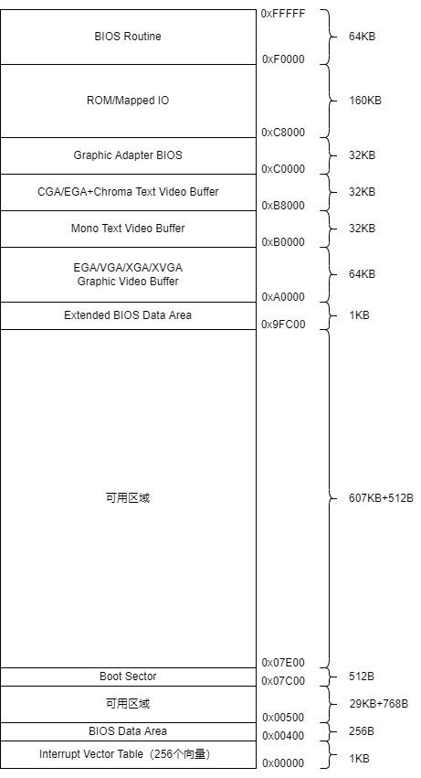

| 起始地址    | 大小         | 用途                  |
|---------|------------|---------------------|
| 0x00000 | 1KB        | BIOS的中断向量表          |
| 0x00400 | 256B       | BIOS数据区             |
| 0x00500 | 29KB+768B  | 可用区域                |
| 0x07C00 | 512B       | 引导扇区数据，被BIOS加载到此处   |
| 0x07E00 | 607KB+512B | 可用区域                |
| 0x9FC00 | 1KB        | 扩展BIOS数据区           |
| 0xA0000 | 64KB       | 彩色显示适配器缓存           |
| 0xB0000 | 32KB       | 黑白显示适配器缓存           |
| 0xB8000 | 32KB       | 文本模式显示适配器缓存         |
| 0xC0000 | 32KB       | 显示适配器BIOS           |
| 0xC8000 | 160KB      | 映射硬件适配器ROM或内存映射式的IO |
| 0xF0000 | 64KB       | BIOS程序，入口地址在0xFFFF0 |