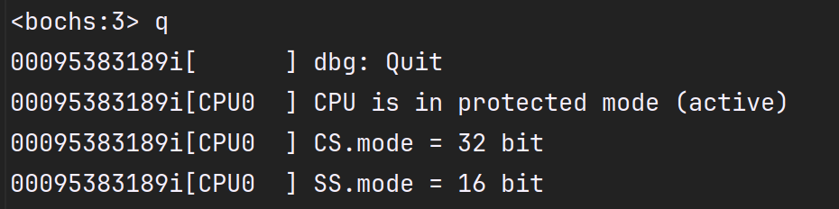

# YuriOS

A tiny OS developed by qingzhixing!

## 👍 Waystones

- [x] 🍎 Booting Success at 2024.5.9!

- [x] 💕 Fat32 Search in Root dir Success at 2024.5.10!

- [x] 🦄 fs寻址能力超过1M at 2024.6.26

- [x] 🖥️ 成功读入kernel.bin at 2024.6.30

- [x] ⌨️ 成功设置VESA VBE模式 at 2024.7.7

- [x] 🐳 成功进入保护模式 at 2024.7.30

