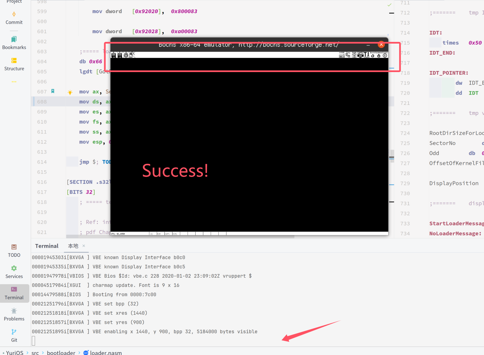
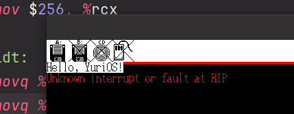

# YuriOS

A tiny OS developed by qingzhixing!

## 👍 Waystones

- [X] 🍎 Booting Success at 2024.5.9!

- [X] 💕 Fat32 Search in Root dir Success at 2024.5.10!

- [X] 🦄 fs寻址能力超过1M at 2024.6.26
  
- [X] 🖥️ 成功读入kernel.bin at 2024.6.30
  
- [X] ⌨️ 成功设置VESA VBE模式 at 2024.7.7
  
  
- [X] 🐳 成功进入保护模式 at 2024.7.30
  
  
  
- [X] 📋 成功为64位下段描述符添加注释 at 2024.8.1
  
- [X] OvO! Load IA32-e GDT! at 2024.8.22
  

> 玩舞萌导致代码崩溃！！
> 原本的默认段寄存器ds写成了舞萌dx里的dx！
> 导致cpu寻址出错！
> 警惕舞萌dx！！！
> 
> 
> 
> 

- [X] 🍰 OwO?! Succeed in enabling Long Mode(Compatibility Mode)! at 2024.9.8
  
- [X] 🐱 ᓚᘏᗢ... Load Into Kernel Space! at 2024.9.8
  
  
- [X] 🌵 VGA显示色彩完美! at 2024.9.10
  
- [X] 🌈 成功修复putchar at 2024.9.13

> printk无法使用,会使屏幕全部变为背景色并陷入死循环

- [X] 😕 使用putchar逐字打印没问题,将问题初步确定在color_printk中处理打印时出错 at 2024.9.15
  
- [X] 🦙 color_printk 打印成功! at 2024.9.15
  

  > 妈妈我再也不随便用AI了TT

>

- [X] 🦄 成功捕获异常并使用异常处理 at 2024.11.10
  

- [X] 成功实现自定义中断处理函数 at 2025.2.23

> 我真的要写哭了.... DeepSeek nb 问了一堆,改来改去不知道为什么就对了,应该是head.S里面不要加载没写完的tss

