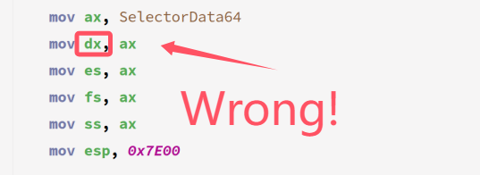

# YuriOS

A tiny OS developed by qingzhixing!

## 👍 Waystones

- [x] 🍎 Booting Success at 2024.5.9!

- [x] 💕 Fat32 Search in Root dir Success at 2024.5.10!

- [x] 🦄 fs寻址能力超过1M at 2024.6.26

- [x] 🖥️ 成功读入kernel.bin at 2024.6.30

- [x] ⌨️ 成功设置VESA VBE模式 at 2024.7.7

- [x] 🐳 成功进入保护模式 at 2024.7.30

- [x] 📋 成功为64位下段描述符添加注释 at 2024.8.1

- [x] OvO! Load IA32-e GDT! at 2024.8.22

> 玩舞萌导致代码崩溃！！  
  原本的默认段寄存器ds写成了舞萌dx里的dx！  
  导致cpu寻址出错！  
  警惕舞萌dx！！！  
> 
> 
> 
> 

- [x] OwO?! Succeed in enabling Long Mode(Compatibility Mode)! at 2024.9.8

- [x] ᓚᘏᗢ... Load Into Kernel Space! at 2024.9.8

